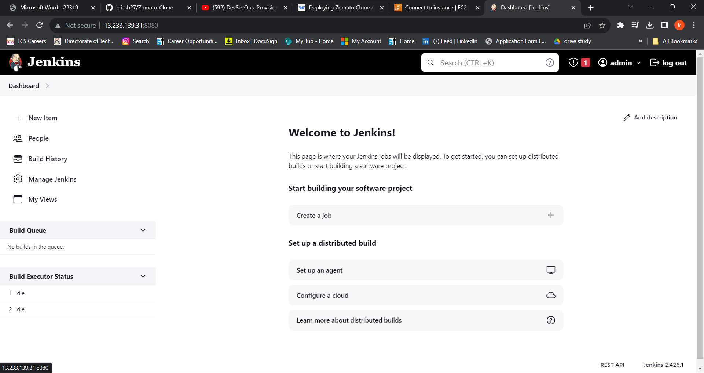
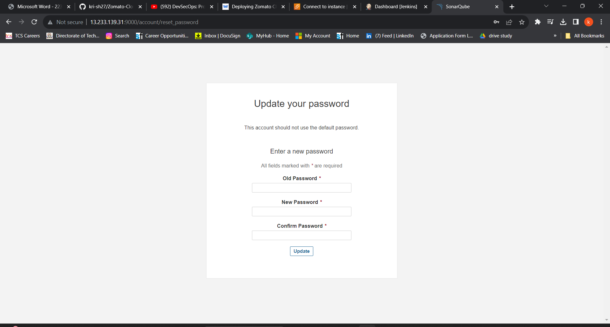
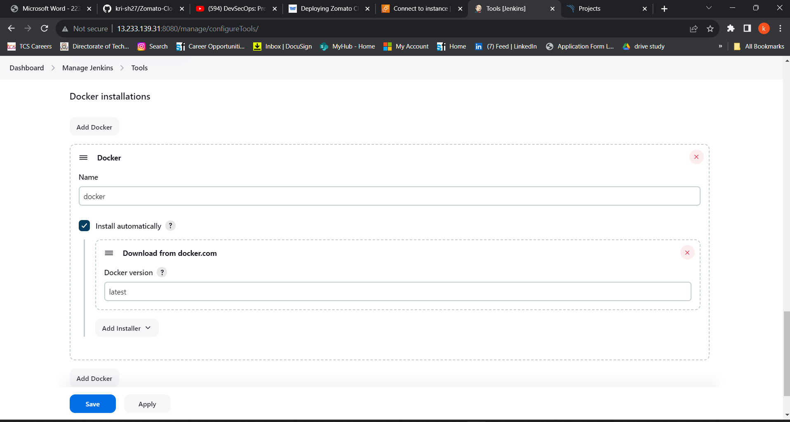

# Getting Started with Create React App

This project was bootstrapped with [Create React App](https://github.com/facebook/create-react-app).

## Available Scripts

In the project directory, you can run:

### `npm start`

Runs the app in the development mode.\
Open [http://localhost:3000](http://localhost:3000) to view it in your browser.

The page will reload when you make changes.\
You may also see any lint errors in the console.

### `npm test`

Launches the test runner in the interactive watch mode.\
See the section about [running tests](https://facebook.github.io/create-react-app/docs/running-tests) for more information.

### `npm run build`

Builds the app for production to the `build` folder.\
It correctly bundles React in production mode and optimizes the build for the best performance.

The build is minified and the filenames include the hashes.\
Your app is ready to be deployed!

See the section about [deployment](https://facebook.github.io/create-react-app/docs/deployment) for more information.

### `npm run eject`

**Note: this is a one-way operation. Once you `eject`, you can't go back!**

If you aren't satisfied with the build tool and configuration choices, you can `eject` at any time. This command will remove the single build dependency from your project.

Instead, it will copy all the configuration files and the transitive dependencies (webpack, Babel, ESLint, etc) right into your project so you have full control over them. All of the commands except `eject` will still work, but they will point to the copied scripts so you can tweak them. At this point you're on your own.

You don't have to ever use `eject`. The curated feature set is suitable for small and middle deployments, and you shouldn't feel obligated to use this feature. However we understand that this tool wouldn't be useful if you couldn't customize it when you are ready for it.

## Learn More

You can learn more in the [Create React App documentation](https://facebook.github.io/create-react-app/docs/getting-started).

To learn React, check out the [React documentation](https://reactjs.org/).

### Code Splitting

This section has moved here: [https://facebook.github.io/create-react-app/docs/code-splitting](https://facebook.github.io/create-react-app/docs/code-splitting)

### Analyzing the Bundle Size

This section has moved here: [https://facebook.github.io/create-react-app/docs/analyzing-the-bundle-size](https://facebook.github.io/create-react-app/docs/analyzing-the-bundle-size)

### Making a Progressive Web App

This section has moved here: [https://facebook.github.io/create-react-app/docs/making-a-progressive-web-app](https://facebook.github.io/create-react-app/docs/making-a-progressive-web-app)

### Advanced Configuration

This section has moved here: [https://facebook.github.io/create-react-app/docs/advanced-configuration](https://facebook.github.io/create-react-app/docs/advanced-configuration)

### Deployment

This section has moved here: [https://facebook.github.io/create-react-app/docs/deployment](https://facebook.github.io/create-react-app/docs/deployment)

### `npm run build` fails to minify

This section has moved here: [https://facebook.github.io/create-react-app/docs/troubleshooting#npm-run-build-fails-to-minify](https://facebook.github.io/create-react-app/docs/troubleshooting#npm-run-build-fails-to-minify)
# Deploying Zomato Clone App with DevSecOps CI/CD
Steps:-

Step 1 — Launch an Ubuntu(22.04) T2 Large Instance

Step 2 — Install Jenkins, Docker and Trivy. Create a Sonarqube Container using Docker.

Step 3 — Install Plugins like JDK, Sonarqube Scanner, Nodejs, and OWASP Dependency Check.

Step 4 — Create a Pipeline Project in Jenkins using a Declarative Pipeline

Step 5 — Install OWASP Dependency Check Plugins

Step 6 — Docker Image Build and Push

Step 7 — Deploy the image using Docker

Step 8 — Terminate the AWS EC2 Instances.

# STEP1:Launch an Ubuntu(22.04) T2 Large Instance
Launch an AWS T2 Large Instance. Use the image as Ubuntu. You can create a new key pair or use an existing one. Enable HTTP and HTTPS settings in the Security Group and open all ports (not best case to open all ports but just for learning purposes it’s okay).
<div align="center">
  
</div>

<br />

# Step 2 — Install Jenkins, Docker and Trivy

## 2A — To Install Jenkins

Connect to your console, and enter these commands to Install Jenkins

```bash
vi jenkins.sh
```

```bash
#!/bin/bash
sudo apt update -y
#sudo apt upgrade -y
wget -O - https://packages.adoptium.net/artifactory/api/gpg/key/public | tee /etc/apt/keyrings/adoptium.asc
echo "deb [signed-by=/etc/apt/keyrings/adoptium.asc] https://packages.adoptium.net/artifactory/deb $(awk -F= '/^VERSION_CODENAME/{print$2}' /etc/os-release) main" | tee /etc/apt/sources.list.d/adoptium.list
sudo apt update -y
sudo apt install temurin-17-jdk -y
/usr/bin/java --version
curl -fsSL https://pkg.jenkins.io/debian-stable/jenkins.io-2023.key | sudo tee \
                  /usr/share/keyrings/jenkins-keyring.asc > /dev/null
echo deb [signed-by=/usr/share/keyrings/jenkins-keyring.asc] \
                  https://pkg.jenkins.io/debian-stable binary/ | sudo tee \
                              /etc/apt/sources.list.d/jenkins.list > /dev/null
sudo apt-get update -y
sudo apt-get install jenkins -y
sudo systemctl start jenkins
sudo systemctl status jenkins
```

```bash
sudo chmod 777 jenkins.sh 
./jenkins.sh
```

Once Jenkins is installed, you will need to go to your AWS EC2 Security Group and open Inbound Port 8080, since Jenkins works on Port 8080.

Now, grab your Public IP Address

```bash
<EC2 Public IP Address:8080> 
sudo cat /var/lib/jenkins/secrets/initialAdminPassword
```

<div align="center">
  
</div>

Unlock Jenkins using an administrative password and install the suggested plugins.

<div align="center">
  
</div>

Jenkins will now get installed and install all the libraries.

Create a user click on save and continue.

Jenkins Getting Started Screen.

<div align="center">
  
</div>

## 2B — Install Docker

```bash
sudo apt-get update 
sudo apt-get install docker.io -y 
sudo usermod -aG docker $USER 
newgrp docker 
sudo chmod 777 /var/run/docker.sock
```
After the docker installation, we create a sonarqube container (Remember to add 9000 ports in the security group).

```bash
docker run -d --name sonar -p 9000:9000 sonarqube:lts-community
```
<div align="center">
  
</div>

now our sonarqube is up and running

<div align="center">
  
</div>
<br />

Enter username and password, click on login and change password

```bash
username admin 
password admin
```

<div align="center">
  
</div>
<br />

Update New password, This is Sonar Dashboard.

<div align="center">
  
</div>
<br />

## 2C — Install Trivy

```bash
sudo apt-get install wget apt-transport-https gnupg lsb-release -y
wget -qO - https://aquasecurity.github.io/trivy-repo/deb/public.key | gpg --dearmor | sudo tee /usr/share/keyrings/trivy.gpg > /dev/null
echo "deb [signed-by=/usr/share/keyrings/trivy.gpg] https://aquasecurity.github.io/trivy-repo/deb $(lsb_release -sc) main" | sudo tee -a /etc/apt/sources.list.d/trivy.list
sudo apt-get update
sudo apt-get install trivy -y
```

Next, we will log in to Jenkins and start to configure our Pipeline in Jenkins

# Step 3 — Install Plugins like JDK, Sonarqube Scanner, NodeJs, OWASP Dependency Check

## 3A — Install Plugin

Goto Manage Jenkins →Plugins → Available Plugins →

Install below plugins

1 → Eclipse Temurin Installer (Install without restart)

2 → SonarQube Scanner (Install without restart)

3 → NodeJs Plugin (Install Without restart)

## 3B — Configure Java and Nodejs in Global Tool Configuration

Goto Manage Jenkins → Tools → Install JDK(17) and NodeJs(16)→ Click on Apply and Save

<div align="center">
  
</div>
<br />
<div align="center">
  
</div>
<br />

## 3C — Create a Job

create a job as Zomato Name, select pipeline and click on ok.

# Step 4 — Configure Sonar Server in Manage Jenkins

Grab the Public IP Address of your EC2 Instance, Sonarqube works on Port 9000, so <Public IP>:9000. Goto your Sonarqube Server. Click on Administration → Security → Users → Click on Tokens and Update Token → Give it a name → and click on Generate Token


<div align="center">
  
</div>
<br />

click on update Token

<div align="center">
  
</div>
<br />

Create a token with a name and generate

<div align="center">
  
</div>
<br />

copy Token

Goto Jenkins Dashboard → Manage Jenkins → Credentials → Add Secret Text. It should look like this 

<div align="center">
  
</div>
<br />

click on create
<div align="center">
  
</div>
<br />

Now, go to Dashboard → Manage Jenkins → System and Add like the below image.
<div align="center">
  
</div>
<br />
Click on Apply and Save


The Configure System option is used in Jenkins to configure different server

Global Tool Configuration is used to configure different tools that we install using Plugins

We will install a sonar scanner in the tools.

<div align="center">
  
</div>
<br />

In the Sonarqube Dashboard add a quality gate also

Administration → Configuration →Webhooks

<div align="center">
  
</div>
<br />

Click on Create

Add details

```bash
<http://jenkins-public-ip:8080>/sonarqube-webhook/
```
Let’s go to our Pipeline and add the script in our Pipeline Script.

```bash
pipeline{
    agent any
    tools{
        jdk 'java17'
        nodejs 'node16'
    }
    environment {
        SCANNER_HOME=tool 'sonar-scanner'
    }
    stages {
        stage('clean workspace'){
            steps{
                cleanWs()
            }
        }
        stage('Checkout from Git'){
            steps{
                git branch: 'main', url: 'https://github.com/kri-sh27/Zomato-Clone.git'
            }
        }
        stage("Sonarqube Analysis "){
            steps{
                withSonarQubeEnv('sonar-server') {
                    sh ''' $SCANNER_HOME/bin/sonar-scanner -Dsonar.projectName=zomato \
                    -Dsonar.projectKey=zomato '''
                }
            }
        }
        stage("quality gate"){
           steps {
                script {
                    waitForQualityGate abortPipeline: false, credentialsId: 'Sonar-token' 
                }
            } 
        }
        stage('Install Dependencies') {
            steps {
                sh "npm install"
            }
        }
    }
}
```
Click on Build now, you will see the stage view like this
<div align="center">
  
</div>
<br />

To see the report, you can go to Sonarqube Server and go to Projects.
<div align="center">
  
</div>
<br />

You can see the report has been generated and the status shows as passed. You can see that there are 1.3k lines. To see a detailed report, you can go to issues.


# Step 5 — Install OWASP Dependency Check Plugins
GotoDashboard → Manage Jenkins → Plugins → OWASP Dependency-Check. Click on it and install it without restart.

First, we configured the Plugin and next, we had to configure the Tool

Goto Dashboard → Manage Jenkins → Tools →


<div align="center">
  
</div>
<br />

Click on Apply and Save here.

Now go configure → Pipeline and add this stage to your pipeline and build.

```bash
stage('OWASP FS SCAN') {
            steps {
                dependencyCheck additionalArguments: '--scan ./ --disableYarnAudit --disableNodeAudit', odcInstallation: 'DP-Check'
                dependencyCheckPublisher pattern: '**/dependency-check-report.xml'
            }
        }
        stage('TRIVY FS SCAN') {
            steps {
                sh "trivy fs . > trivyfs.txt"
            }
        }
```
The stage view would look like this,
<div align="center">
  
</div>
<br />

You will see that in status, a graph will also be generated and Vulnerabilities.

<div align="center">
  
</div>
<br />


# Step 6 — Docker Image Build and Push
We need to install the Docker tool in our system, Goto Dashboard → Manage Plugins → Available plugins → Search for Docker and install these plugins
```bash
Docker
```
```bash
Docker Commons
```
```bash
Docker Pipeline
```
```bash
Docker API
```
```bash
docker-build-step
```

and click on install without restart

<div align="center">
  
</div>
<br />


Now, goto Dashboard → Manage Jenkins → Tools →

<div align="center">
  
</div>
<br />

Add DockerHub Username and Password under Global Credentials

<div align="center">
  
</div>
<br />

Add this stage to Pipeline Script

```bash
       stage("Docker Build & Push"){
            steps{
                script{
                   withDockerRegistry(credentialsId: 'docker', toolName: 'docker'){   
                       sh "docker build -t zomato ."
                       sh "docker tag zomato krishnahogale/zomato:latest "
                       sh "docker push krishnahogale/zomato:latest "
                    }
                }
            }
        }
        stage("TRIVY"){
            steps{
                sh "trivy image krishnahogale/zomato:latest > trivy.txt" 
            }
        }
```

You will see the output with a dependency trend.


When you log in to Dockerhub, you will see a new image is created

Now Run the container to see if the app coming up or not by adding the below stage

```bash
stage('Deploy to container'){
     steps{
            sh 'docker run -d --name zomato -p 3000:3000 krishnahogale/zomato:latest'
          }
      }
```

stage view

<div align="center">
  
</div>
<br />

You will get this output

<Jenkins-public-ip:3000>

<div align="center">
  
</div>
<br />
<div align="center">
  
</div>
<br />

# Step 8: Terminate instances.
# Complete Pipeline


```bash
pipeline{
    agent any
    tools{
        jdk 'java17'
        nodejs 'node16'
    }
    environment {
        SCANNER_HOME=tool 'sonar-scanner'
    }
    stages {
        stage('clean workspace'){
            steps{
                cleanWs()
            }
        }
        stage('Checkout from Git'){
            steps{
                git branch: 'main', url: 'https://github.com/kri-sh27/Zomato-Clone.git'
            }
        }
        stage("Sonarqube Analysis "){
            steps{
                withSonarQubeEnv('sonar-server') {
                    sh ''' $SCANNER_HOME/bin/sonar-scanner -Dsonar.projectName=zomato \
                    -Dsonar.projectKey=zomato '''
                }
            }
        }
        stage("quality gate"){
           steps {
                script {
                    waitForQualityGate abortPipeline: false, credentialsId: 'Sonar-token' 
                }
            } 
        }
        stage('Install Dependencies') {
            steps {
                sh "npm install"
            }
        }
        stage('OWASP FS SCAN') {
            steps {
                dependencyCheck additionalArguments: '--scan ./ --disableYarnAudit --disableNodeAudit', odcInstallation: 'DP-Check'
                dependencyCheckPublisher pattern: '**/dependency-check-report.xml'
            }
        }
        stage('TRIVY FS SCAN') {
            steps {
                sh "trivy fs . > trivyfs.txt"
            }
        }
        stage("Docker Build & Push"){
            steps{
                script{
                   withDockerRegistry(credentialsId: 'docker', toolName: 'docker'){   
                       sh "docker build -t zomato ."
                       sh "docker tag zomato krishnahogale/zomato:latest "
                       sh "docker push krishnahogale/zomato:latest "
                    }
                }
            }
        }
        stage("TRIVY"){
            steps{
                sh "trivy image krishnahogale/zomato:latest > trivy.txt" 
            }
        }
        stage('Deploy to container'){
            steps{
                sh 'docker run -d --name zomato -p 3000:3000 krishnhogale/zomato:latest'
            }
        }
    }
}
```